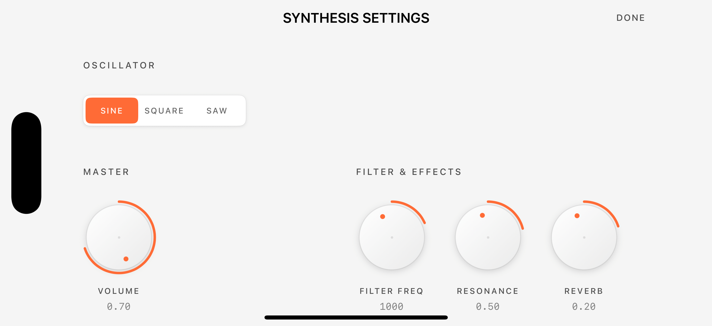
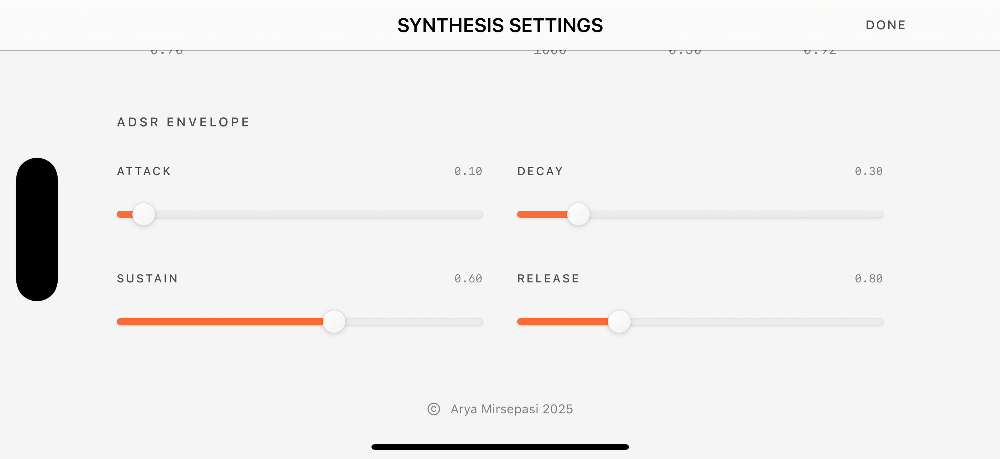

# MiniSynth

A real-time audio synthesizer built with SwiftUI and AVAudioEngine, showcasing professional-grade audio processing and intuitive user interface design.

## Features

### Audio Engine
- **Real-time synthesis** with sine, square, and sawtooth waveforms
- **ADSR envelope** for natural note articulation  
- **Low-pass filter** with resonance control
- **Reverb effect** for spatial depth
- **Zero-latency** audio processing using AVAudioEngine

### User Interface
- **Dieter Rams-inspired design** with custom knobs and sliders
- **Interactive piano keyboard** with haptic feedback
- **Real-time parameter control** with smooth audio updates
- **Responsive SwiftUI** layout for all device sizes

  
  
  

## Technical Implementation

### Audio Processing
Built on **AVAudioEngine** and **Core Audio** for minimal latency:
- Custom `AVAudioSourceNode` for real-time synthesis
- Audio graph: Synthesizer → Filter → Reverb → Output
- Thread-safe parameter updates
- Proper audio session management

### UI Components
- Custom `BraunKnob, BraunSlider, and BraunPicker` with gesture-based control
- Smooth animations with Core Animation
- Haptic feedback integration

## Requirements
- iOS 17.0+

## Installation
1. Clone the repository
2. Open `MiniSynth.xcodeproj`
3. Build and run on device or simulator

## Architecture
- Audio Thread: SynthAudioEngine → AVAudioSourceNode → Real-time Processing
- UI Thread: SwiftUI Views → Parameter Binding → Audio Engine Updates
